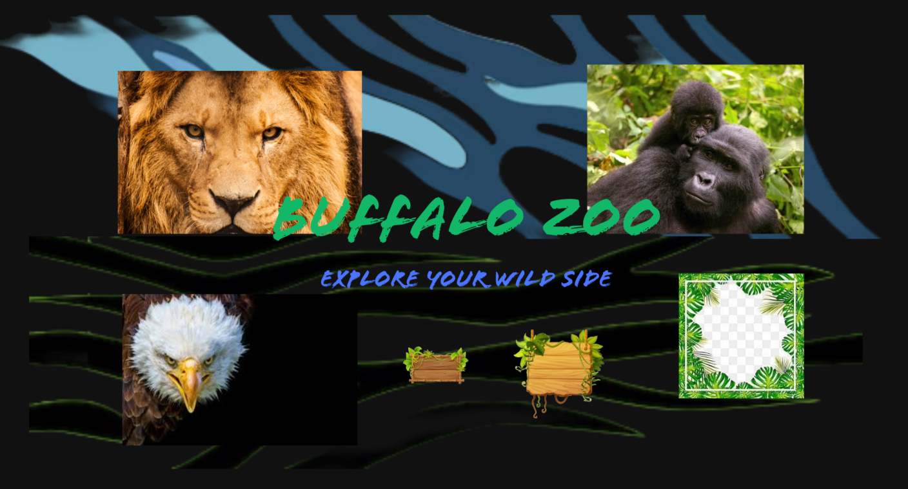

# Zoo Website Redesign - [Back Home](index.md)
[View Prototype](https://www.figma.com/proto/pnvTYex16bkdXRIZHD5ULB/Buffalo-Zoo-App?node-id=0-1&t=VfKtDwo5rOfuRw3B-1)
## About The Design
In this design I had to use an existing website and redesign it to be a mobile app. This forced me to learn how important screen space was and that using paper prototypes to get lots of ideas quickly is much more efficient for your time than jumping staight into a high fidelity prototype then having to make changes to everything.
### Highlights
1. I was happy with the way I used theming to maintain the vibe of the website and be able to keep it in such a compact mobile design.
   
   **This is a mood board I used to help myself understand the theme and implement it into my design**
3. I liked the menu layout where most of the buttons to navigate pages are at the bottom and remain static between pages
